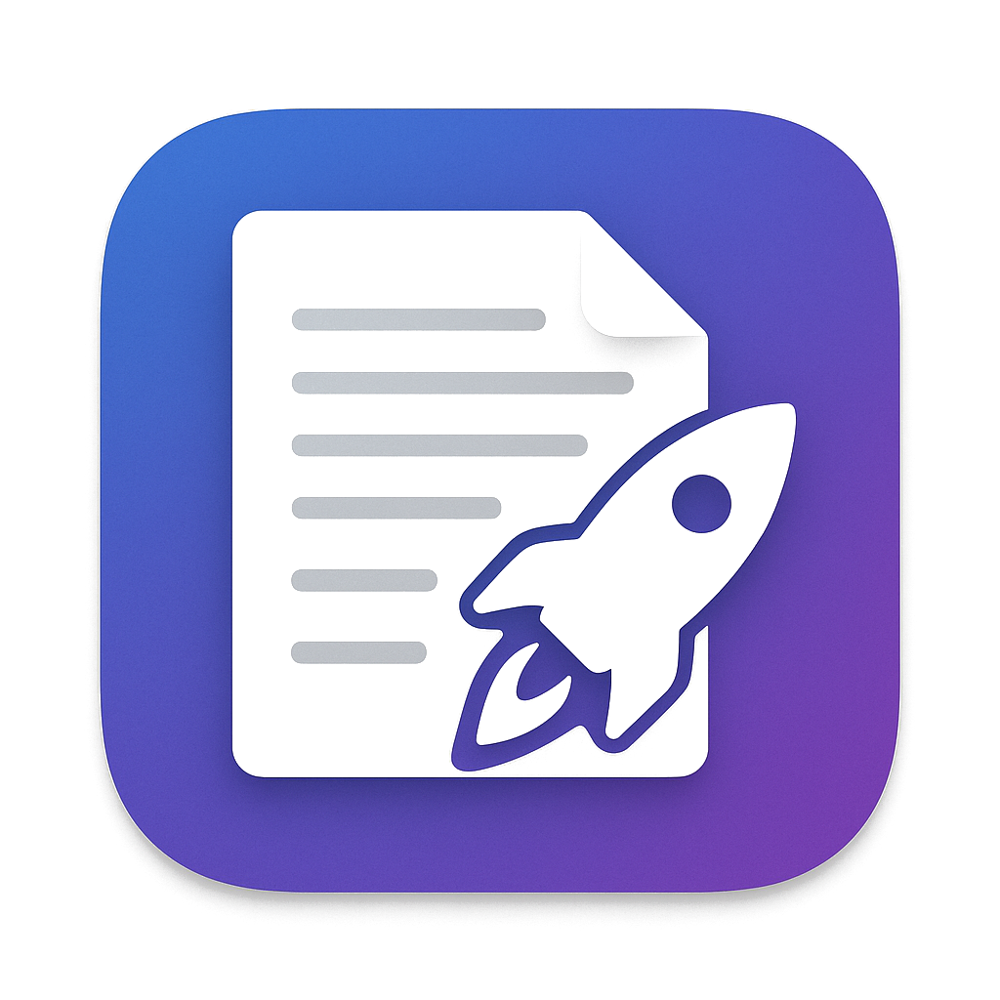

# Script Launcher

A lightweight, native macOS app for managing and launching scripts across different projects with a clean GUI.



Script Launcher helps developers and AI assistants manage project-specific scripts efficiently. Each script appears with its emoji icon, name, and description in a clean macOS interface.

## Latest Version: 2.3

### What's New
- **Run Buttons** - Each script has a dedicated Run button (no accidental execution)
- **Better Project Display** - Shows project names in title bar and under Scripts header
- **Improved Recent Projects** - Shows "ProjectName — ParentFolder" for clarity
- **Toolbar Shortcuts** - Quick access buttons for Init (➕) and Load (📁) projects
- **Enhanced LLM Instructions** - Config files guide AI assistants to save tokens
- **Info Buttons** - Long descriptions show (i) icon for full view in popover

## Features

- **Native macOS app** - Only ~2MB, built with Swift/SwiftUI
- **Project-based organization** - Each project has its own `.scriptlauncher.json` config
- **Real-time output** - See script output as it runs
- **Persistent state** - Remembers recent projects and last loaded project
- **Clean UI** - Split view with scripts list and output console
- **Dock support** - Pin to dock for quick access
- **Detailed descriptions** - Multi-line descriptions with overflow handling
- **Token-efficient** - Designed for AI assistants to save tokens by reusing scripts

## Quick Start

1. **Build the app:**
   ```bash
   ./build.sh
   ```

2. **Install to Applications (optional):**
   ```bash
   ./install.sh
   ```

3. **Launch and configure:**
   - Open Script Launcher from Applications or the build directory
   - Click "Init New Project" to create a config in any directory
   - Or "Load Project" to open an existing `.scriptlauncher.json`

## Configuration Format

Each project has a `.scriptlauncher.json` file in its root directory:

```json
{
  "scripts": [
    {
      "name": "Build Project",
      "icon": "🔨",
      "path": "./build.sh",
      "description": "Build the current project",
      "workingDirectory": "/optional/working/dir"
    },
    {
      "name": "Run Tests",
      "icon": "🧪",
      "path": "npm test",
      "description": "Run test suite"
    },
    {
      "name": "Deploy",
      "icon": "🚀",
      "path": "python3 deploy.py --production",
      "description": "Deploy to production"
    }
  ]
}
```

### Script Examples

- **Shell commands**: `"path": "npm run build"`
- **Python scripts**: `"path": "python3 script.py"`
- **Shell scripts**: `"path": "./run.sh"`
- **Complex commands**: `"path": "cd src && make clean && make"`

### Script Fields

- `name` (required): Display name in the UI
- `icon` (required): Emoji icon for the script
- `path` (required): Command or script to execute
- `description` (required): Brief description of what the script does
- `workingDirectory` (optional): Override the default working directory

## Claude Code Integration

Script Launcher is designed to work efficiently with AI coding assistants like Claude Code. By storing frequently-used commands as scripts, it helps save tokens and avoid repetitive code generation.

### How It Saves Tokens

Instead of having Claude regenerate deployment scripts, build commands, or test scripts in every conversation, you can:

1. **Ask Claude once** to create the scripts and add them to `.scriptlauncher.json`
2. **Run scripts by name** in future conversations: "Hey Claude, run the Deploy script"
3. **Avoid regeneration** - Claude doesn't need to recreate the same scripts repeatedly

### Example Workflow

First conversation:
```
User: "Create a deployment script for this Node.js project"
Claude: "I'll create a deployment script and add it to Script Launcher..."
[Creates deploy.sh and adds to .scriptlauncher.json]
```

Future conversations:
```
User: "Deploy the app to production"
Claude: "Run the 'Deploy to Production' script in Script Launcher"
[No need to regenerate the deployment script]
```

### Best Practices

- Use **descriptive names** for scripts so they're easy to reference
- Add **detailed descriptions** explaining what each script does
- Include **multi-line descriptions** for complex scripts:
  ```json
  {
    "description": "Deploys to production:\n- Builds the app\n- Runs tests\n- Pushes to server"
  }
  ```

## Building from Source

### Requirements

- macOS 11.0 or later
- Xcode Command Line Tools (`xcode-select --install`)

### Build Steps

```bash
# Clone the repository
git clone https://github.com/yourusername/script-launcher.git
cd script-launcher

# Build the app
./build.sh

# Optionally install to /Applications
./install.sh
```

### Creating a DMG Installer

To create a distributable DMG file:

```bash
# After building, create DMG
./create_dmg.sh
```

This creates `ScriptLauncher.dmg` that users can:
1. Double-click to mount
2. Drag Script Launcher to Applications
3. Eject when done

The DMG is ~2MB and includes the app with its custom icon.

## Project Structure

```
script-launcher/
├── ScriptLauncher/
│   └── Sources/
│       └── main.swift    # Complete SwiftUI application
├── build.sh              # Build script
├── install.sh            # Install to /Applications
├── create_icon.sh        # Icon generation script
├── icon_clean.png        # App icon (cleaned version)
├── Rocket and Paper Icon Design.png  # Original icon
└── README.md
```

## Contributing

Contributions are welcome! Please feel free to submit a Pull Request.

## License

This project is open source and available under the [MIT License](LICENSE).